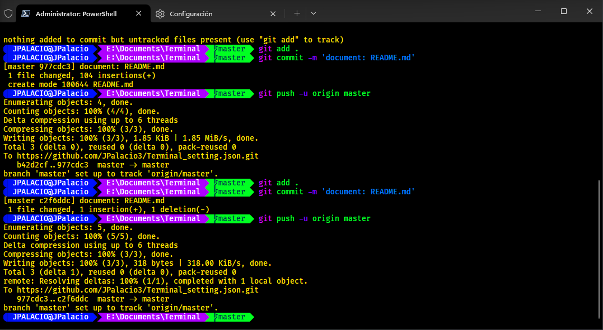

# Configuración personalizada de Windows Terminal

Este repositorio contiene mi configuración personalizada para Windows Terminal. Aquí puedes encontrar los ajustes y esquemas de colores que utilizo para mejorar mi experiencia con Windows Terminal.

## Capturas de pantalla



## Requisitos

- Windows 10 o superior.
- Windows Terminal instalado. Puedes descargarlo desde [Microsoft Store](https://aka.ms/terminal-documentation).

## Instalación

1. Descarga e instala Windows Terminal desde [Microsoft Store](https://aka.ms/terminal-documentation).

2. Abre Windows Terminal.

3. Abre el menú de configuración haciendo clic en el icono de engranaje o presionando `Ctrl + ,`.

4. Reemplaza el contenido del archivo `settings.json` con el contenido del archivo `settings.json` proporcionado en este repositorio.

5. Guarda el archivo de configuración.

6. Reinicia Windows Terminal para aplicar los cambios.

## Configuración predeterminada

Para mantener esta configuración como predeterminada al iniciar Windows Terminal, sigue estos pasos:

1. Abre el menú de configuración de Windows Terminal.

2. Asegúrate de que esta configuración esté seleccionada como la configuración predeterminada en el archivo `settings.json`.

```
"defaultProfile": "{574e775e-4f2a-5b96-ac1e-a2962a402336}"
```

3. Guarda el archivo de configuración.

## Esquemas de colores

Esta configuración utiliza varios esquemas de colores para personalizar la apariencia de Windows Terminal:

- **Joel**: Un esquema de colores oscuros con colores intensos y un fondo negro.

- **Campbell**: Otro esquema de colores oscuros con una paleta de colores diferente.

- **One Half Dark**: Un esquema de colores oscuros con colores suaves y relajantes.

- **One Half Light**: Un esquema de colores claros, perfecto para la lectura durante el día.

- **Solarized Dark**: Basado en el popular esquema de colores Solarized, con un fondo oscuro.

- **Solarized Light**: La versión clara del esquema de colores Solarized.

- **Tango Dark**: Inspirado en el esquema de colores Tango, con un fondo oscuro.

- **Tango Light**: La versión clara del esquema de colores Tango.

- **Vintage**: Un esquema de colores con una estética vintage y fondo negro.

Siéntete libre de elegir el esquema de colores que mejor se adapte a tu gusto personal.

## Iconos y temas

Esta configuración utiliza el esquema de íconos "Oh My Posh" y un tema específico. Para configurarlos:

1. Instala Oh My Posh siguiendo las [instrucciones de instalación](https://ohmyposh.dev/docs/installation).

2. Configura Oh My Posh con el tema que desees. Puedes encontrar temas disponibles en el [repositorio de temas de Oh My Posh](https://github.com/JanDeDobbeleer/oh-my-posh).

3. Abre el archivo `settings.json` y busca la sección `defaults` para asegurarte de que esté configurada correctamente.

```json
"defaults": {
    "font": {
        "face": "FiraCode Nerd Font Mono",
        "size": 10.0
    },
    "colorScheme": "Joel"
},
```

## Atajos de teclado

- `Ctrl + C`: Copiar.
- `Ctrl + V`: Pegar.
- `Alt + Shift + D`: Dividir la terminal en un nuevo panel.
- `Ctrl + Shift + F`: Buscar en la terminal.

## Configuración de los íconos
- -> Configurar iconos
`Install-Module -Name Terminal-Icons -Repository PSGallery` 
`Import-module Terminal-Icons` 

## Configuración del perfil predeterminado
- -> Configurar un nuevo perfil para guardar las configuraciones de inicio:
  
`New-Item -Path $PROFILE -Type File -Force`
`notepad $PROFILE`

- -> se escribe el siguiente código para configurar los valores predeterminados de la  aplicación:

`(@(& 'C:/Users/JPalacio/AppData/Local/Programs/oh-my-posh/bin/oh-my-posh.exe' init pwsh --config='C:\Users\JPalacio\AppData\Local\Programs\oh-my-posh\themes\aliens.omp.json' --print) -join "`n") | Invoke-Expression `


## Contacto

Si tienes alguna pregunta o comentario sobre esta configuración, no dudes en ponerte en contacto conmigo.

Disfruta de tu experiencia mejorada con Windows Terminal!


Este README.md incluye información sobre cómo mantener la configuración predeterminada y cómo configurar íconos y temas usando Oh My Posh. Asegúrate de personalizarlo aún más según tus necesidades y preferencias. ¡Espero que esto te ayude a compartir tu configuración de Windows Terminal de manera más completa!
